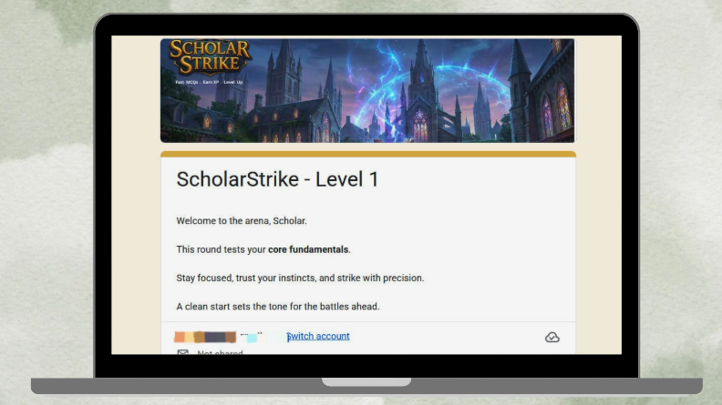
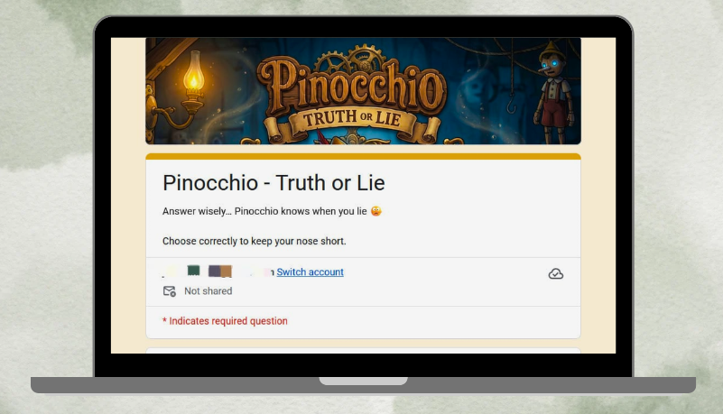

# 🚀 Setup Guide

## Quick Start

### 1. Access the Platform
Visit: [https://sites.google.com/view/nerdyfy/home?authuser=0]

### 2. Try the Prototype
- Click "Try Demo"
- Navigate through Canva screens
- Click game cards to play

### 3. Play Mini-Games
- Scholar Strike: Test pointer knowledge
- Pinocchio's Code: Find bugs
- Harry Pot: Logic building
- No login required!

### 4. Check Leaderboard
- View live XP rankings
- See guild standings
- Track competition

### 5. Explore Guild Resources
- Access shared Drive folder
- View code examples

## For Developers

### Local Testing (Future)
```bash
# Clone repository
git clone https://github.com/[your-username]/Nerdyfy-learning-platform. Git

# Install dependencies (when Flutter version launches)
flutter pub get

# Run app
flutter run
```

### Environment Variables (Future)
```
FIREBASE_API_KEY=your key
GEMINI_API_KEY=your key
```

## Current Links
- Game Forms:  
- Scholar Strike: Test pointer knowledge
  
 [https://docs.google.com/forms/d/e/1FAIpQLScYjz8rHio8Irf1U34NSemzKg7w7G2DolvFVP-5PyeSeygqYA/viewform?usp=sharing&ouid=108543683356947191838]

- Pinocchio's Code: Find bugs
  
 [https://docs.google.com/forms/d/e/1FAIpQLSceQJVAhJ8RQe9FyZeSjaiugJGi0MMEjGTwrkBm9VtV6W61Dw/viewform?usp=sharing&ouid=108543683356947191838]

- Harry Pot: Logic building
 
[https://docs.google.com/forms/d/e/1FAIpQLSfnPb3sea64bEcnkDOJzISU4fYsDM7A4aqApSMOmig4cOHDjg/viewform?usp=sharing&ouid=108543683356947191838]

- Sheets: [https://docs.google.com/spreadsheets/d/1-Kd8GTbI9l6gie62Yzy6Mk6PDvZ9Ok4boJr4ZTTV5CA/edit?usp=sharing]

- Drive: [https://drive.google.com/drive/folders/1_SVfk6ChpVOhCDFyKzN5figIPhyRYM5q?usp=sharing]

