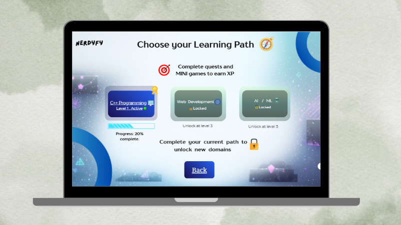
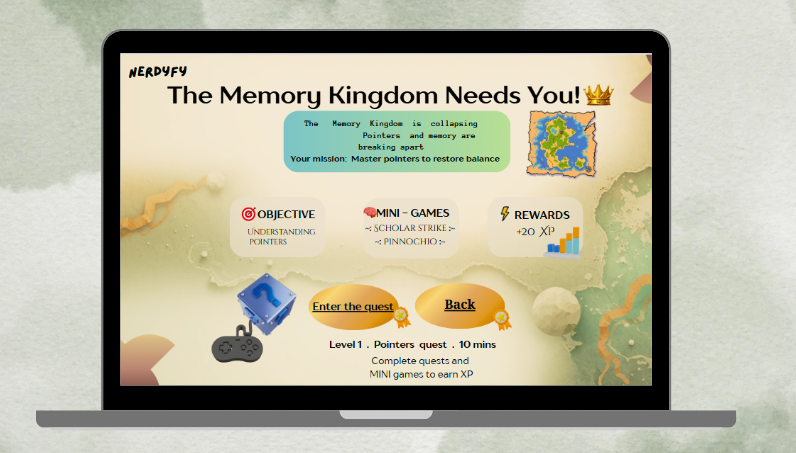
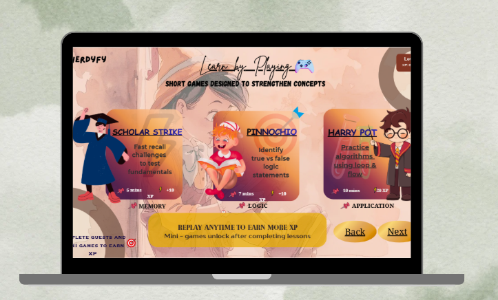
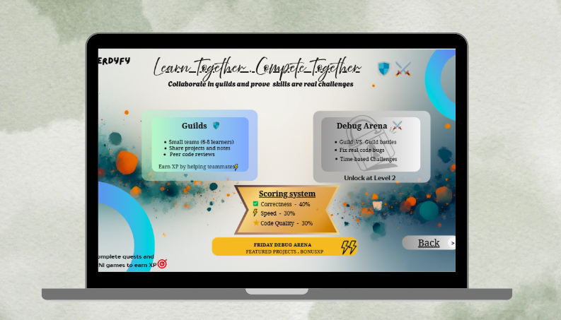

#UI-overview : Nerdyfy
This document showcases the user interface of Nerdyfy, a gamified community learning platform. The UI is designed using Canva and implemented as a prototype via Google Sites and Google Forms.

---

## Design Philosophy
- Learning-first, game-inspired interface
- Simple navigation with clear progression
- Visual feedback through XP, levels, and quests
- Beginner-friendly and non-intimidating

---

## Landing & Dashboard

- Greets the user and sets the tone for a learning journey
- Clear primary action: “Start Learning”
- Introduces XP, quests, and mini-games
- Encourages full-screen mode for better immersion

---

## Learning Path Selection

- Displays available domains (C++, Web Dev, AI/ML)
- Locked paths introduce progression-based motivation
- Shows progress percentage and unlock conditions
- Reinforces XP-based growth

Current state:
- C++ Level 1 active
- Web Dev & AI locked until higher levels

---

## Story-Driven Quest Interface

- Learning concepts are wrapped in narrative quests
- Example quest focuses on pointers and memory
- Clear objective and estimated time (10 minutes)
- Mini-games listed within the quest
-  XP rewards clearly displayed

---

## Mini-Games Section

- Scholar Strike – fast recall of fundamentals
- Pinocchio Logic – true/false debugging challenges
- Algorithm Practice – loop and flow-based problem solving

Each mini-game:
- Is short (5–10 minutes)
- Rewards XP
- Can be replayed to reinforce concepts

---

## Progress & Feedback
- XP meter shows real-time progress
- Level indicator motivates continuation
- Success and retry states focus on improvement, not punishment

---

## Competitive & Collaborative Learning

### Guild System
- Small teams of 6–8 learners
- Shared notes and projects
- Peer code reviews with XP incentives

### Friday Debug Arena
- Guild vs Guild competitive debugging
- Real code bug-fixing under time pressure
- Transparent scoring:
  - Correctness – 40%
  - Speed – 30%
  - Code Quality – 30%

Unlocks at Level 2.

---

## Tools Used for UI Prototype
- Canva – UI design and visual layouts
- Google Sites – platform navigation
- Google Forms – quizzes, mini-games, and interactions
- Google Drive – guild resources and collaboration

